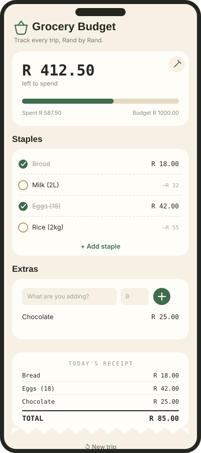

# Grocery Budget

A mobile-first grocery budget tracker. Set a budget, check off staples as you
buy them, add one-off extras, and watch a live receipt tally your spend as
you shop.

<p align="center">
  
</p>

## Features

- **Set a budget** for the trip, and edit it any time from the same card.
- **Staples** — a starting list of common household groceries. Tap one to
  confirm the price you paid; tap again to undo. Add or remove staples to
  match your own household.
- **Extras** — a quick name + price field for anything that isn't on your
  staples list.
- **Live progress bar** that fills as you spend, and turns red the moment
  you go over budget.
- **Running receipt** of everything bought this trip, in the order you
  bought it, with a running total.
- **New trip** resets checkmarks and extras while keeping your budget and
  staple list intact for next time.
- Data is saved to the browser's `localStorage`, so it survives closing the
  tab or refreshing the page.

## Getting started

```bash
npm install
npm run dev
```

Open the URL Vite prints (usually `http://localhost:5173`). Resize the
window, or open your browser's device toolbar, to check the mobile layout.

## How to use it

1. **Set your budget.** On first open, type in what you plan to spend and
   tap **Set**.
2. **Check off staples as you buy them.** Tapping an unchecked item opens a
   small price field pre-filled with an estimate — confirm the amount you
   actually paid, and it's deducted from your budget. Tap a checked item
   again to undo it.
3. **Add anything that isn't a staple** in the Extras section — type a name
   and price, then tap the **+** button.
4. **Watch the receipt** at the bottom fill in as you go, in the order you
   bought things, with a running total.
5. **Start a new trip** once you're done — this clears your checkmarks and
   extras but keeps your budget and staple list ready for next time.

## Project structure

```
src/
  main.jsx                  entry point, mounts <App /> into the DOM
  App.jsx                   top-level layout, wires the hook to components
  index.css                 Tailwind + font imports
  constants/colors.js       color palette and shared tokens
  data/defaultStaples.js    the starter list of staple grocery items
  hooks/useGroceryState.js  all state, calculations, and localStorage persistence
  components/
    Money.jsx                Rand-formatted number
    BudgetSection.jsx        set/edit budget, progress bar
    StaplesSection.jsx       staples list + add-staple form
    StapleRow.jsx            a single staple row (checkbox / inline price entry)
    ExtrasSection.jsx        add-extra form + extras list
    Receipt.jsx               running receipt with the torn-paper edge
```

## Built with

- [React](https://react.dev) + [Vite](https://vitejs.dev)
- [Tailwind CSS](https://tailwindcss.com) for layout and spacing
- Plain inline SVG for icons, no icon library required

## Notes

Data is stored per-browser via `localStorage`, so it won't follow you
between devices. If you want your budget and staples to sync across your
phone and laptop, the next step would be swapping the persistence layer in
`useGroceryState.js` for a small backend (e.g. Supabase).